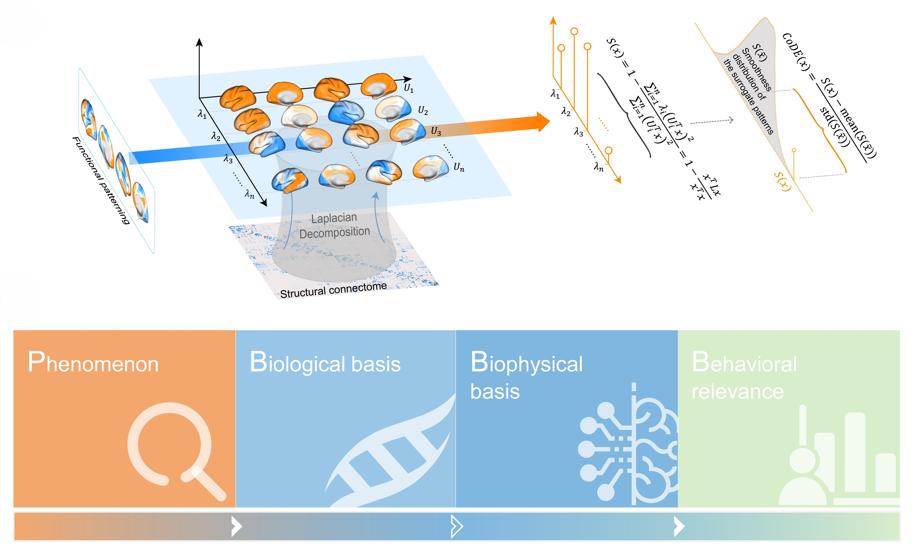

## 🧠 Overview
This repository accompanies the manuscript _"Dynamic Embeddedness within the Structural Connectome Orchestrates Macroscale Functional Organization of the Human Brain"_.

In this study, we introduce the concept of structural connectome embeddedness and propose a new quantitative measure, the connectome-driven embedding (_CoDE_), that captures the topological smoothness of functional activity patterns over the structural connectome.

Here, we provide the core code for computing _CoDE_, along with a concise tutorial illustrating its application using quasi-periodic pattern (QPP) data. The QPP dataset used in the tutorial is publicly available at [Github](https://github.com/GT-EmoryMINDlab) [1]. 

This repository is intended to facilitate transparent implementation, reproducibility, and adaptation of the _CoDE_ framework in future studies examining structure-function relationships in the human brain.

## ⚙️ Environment Setup
```
conda env create -f ./env/environment.yml
conda activate CoDE
python -c "import numpy, pandas, matplotlib, seaborn, scipy, proplot; import neuromaps; print('Environment setup successful')"
```

## 🧩 Data Description
The `/data` folder contains the input datasets used in the tutorial example for computing the connectome-driven embedding (_CoDE_):
+ `space-fsLR_atlas-Brainnetome_den-91k_dseg.dlabel.nii` : Brainnetome Atlas [2] in fsLR space. 
+ `Brainnetome-dlabel-info.csv` : Metadata of `space-fsLR_atlas-Brainnetome_den-91k_dseg.dlabel.nii`.
+ `spin_nulls.npy` : Permutation indices for the spin test. The permutation indices were created using the `neuromaps.nulls.vasa` function, with the number of rotations set to 10,000.
+ `func_gradient.csv` : The functional gradient values [3] parcellated according to the Brainnetome Atlas. The data was derived using the `neuromaps` toolbox [4].
+ `QPP_x.csv` : Quasi-periodic pattern (QPP) data [1] parcellated according to Brainnetome Atlas. Each row corresponds to a brain region, and each column represents a time point of the QPP.
+ `sc_consensus.csv` : Group-consensus structural connectivity matrix derived from diffusion MRI tractography.

To comply with data-use policies and avoid redistribution of large public datasets used in the study (e.g., HCP and AHBA), the full empirical datasets are not included in this capsule. 
Instead, we provide minimal example data that allow users to reproduce the CoDE computation pipeline and test its application on fMRI data.
By replacing the input data, the pipeline can be readily applied to reproduce additional results related to structural connectome embeddedness reported in the literature.

## 📄 Usage
This repository provides two complementary ways to run the structural connectome embeddedness analysis, depending on the desired level of interaction. 

> **Note:** The analysis relies on relative paths. For both execution modes, please ensure that the working directory is set to  
> `/path/to/Structural-Connectome-Embeddedness/code` before running any scripts or notebooks.

### ▶️ One-step execution (script-based)
First, navigate to the code directory
```bash
cd /path/to/Structural-Connectome-Embeddedness/code
```

You can then run the full analysis for the QPP-based embeddedness example using:
```bash
python main.py
```

This command executes the complete analysis pipeline in a single step.
All generated outputs and intermediate results will be saved to the `/path/to/Structural-Connectome-Embeddedness/results/` directory.

### 📓 Step-by-step execution (interactive Jupyter notebook)

Alternatively, the analysis can be explored interactively using a Jupyter notebook. 
First, navigate to the code directory
```bash
cd /path/to/Structural-Connectome-Embeddedness/code
```

Then open and run the tutorial notebook: `/path/to/Structural-Connectome-Embeddedness/code/tutorial.ipynb`


This notebook walks through the analysis pipeline step by step, allowing users to inspect intermediate results, modify parameters, and better understand each component of the workflow.

> Notes: The provided scripts and notebook are intended to demonstrate the CoDE analysis pipeline.
By replacing the input data, the same pipeline can be applied to reproduce and explore related analyses of structural connectome embeddedness.


## Reference
1. Yousefi, B. & Keilholz, S. Propagating patterns of intrinsic activity along macroscale gradients coordinate functional connections across the whole brain. _Neuroimage_ 231, 117827 (2021).
2. Fan, L. et al. The Human Brainnetome Atlas: A New Brain Atlas Based on Connectional Architecture. _Cereb. Cortex_ 26, 3508-3526 (2016).
3. Margulies, D. S. et al. Situating the default-mode network along a principal gradient of macroscale cortical organization. _Proc. Natl. Acad. Sci._ 113, 12574-12579 (2016).
4. Markello, R. D. et al. Neuromaps: structural and functional interpretation of brain maps. _Nat. Methods_ 19, 1472-1479 (2022).

## Others
Other analyses based on open-source code are __not included__ in this repository. Details of the external dependencies can be found in the table below or in the main manuscript.

| Analysis                                 | Toolbox / Package | Source / Link      | Related Figures |
|------------------------------------------|--------------------|--------------------|-----------------|
| Brain visualization                      | **surfplot**        | [Document Link](https://surfplot.readthedocs.io/en/latest/)      | All figures     |
| Gene set enrichment analysis (GSEA)      | **GSEApy**         | [Document Link](https://gseapy.readthedocs.io/en/latest/)      | Figure 4        |
| Dynamic mean-field (DMF) model           | **fastDMF**        | [GitLab Link](https://www.gitlab.com/concog/fastdmf)        | Figure 5        |
| Partial least squares correlation (PLSC) | **myPLS**          | [GitHub Link](https://github.com/MIPLabCH/myPLS)        | Figure 6        |


For any questions regarding the data or code, please contact Weiyang Shi (shiweiyang2017@ia.ac.cn).
